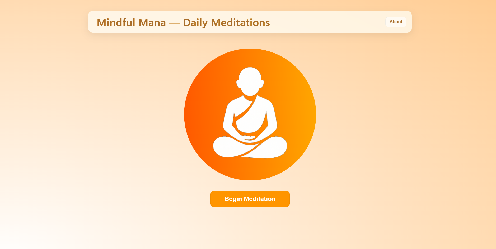
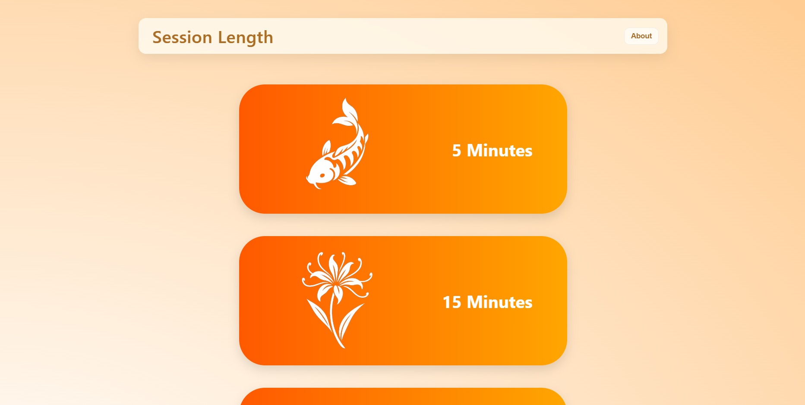

# MindfulMana
A simple, calming React meditation app focused on guided breathing sessions, daily mindfulness reminders, and beginner-friendly UI.

MindfulMana is a lightweight React application designed to help users practice structured breathing and build consistent meditation habits. It emphasizes simplicity, accessibility, and a clean UI suitable for beginners.

## Features (Planned)
- Guided breathing cycle with inhale/hold/exhale animation  
- Daily mindfulness quote (API or fallback local data)  
- Meditation streak tracking using localStorage  
- Responsive, mobile-friendly UI  
- Ambient sound toggle  
- Clean, accessible design  

## Demo
Shipped Vercel Version: https://mindful-mana.vercel.app/

## DEMO LOGIN
Email: joetest@domain.com

Pass: 1234567

GH Pages Front End: https://preytorkamen.github.io/mindfulmana/


### 🖼️ Preview Images




## Tech Stack
- React (Vite)
- JavaScript
- CSS Modules
- LocalStorage for persistence
- Fetch API for data retrieval

## Installation

1. Clone the repo  
```bash
git clone https://github.com/<user>/mindfulmana.git
cd mindfulmana
npm install
npm run dev
```

## Project Structure
/src
  /components
  /hooks
  /pages
  /assets
  App.jsx
  main.jsx


## Status
🚧 In active development. Initial features in progress.

## Contributing
This project is open to improvements and suggestions. Please review the existing guidelines in CONTRIBUTING.md before contributing.

## Code of Conduct
This project adheres to the Contributor Covenant Code of Conduct. For details, see CODE_OF_CONDUCT.md.

## License
Distributing under the MIT License. See LICENSE for more information.


